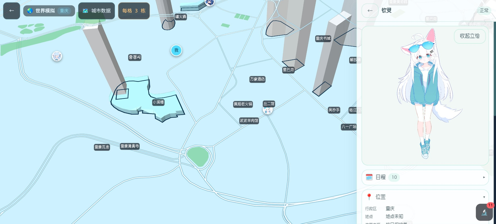

# LingChat · 世界模拟

这是 `sukiiiimansui-dotcom/LingChat` —— 在官方 LingChat 上开的一条支线：
把「**世界模拟**」（真实 2.5D 地图 ＋ 真实 3D 楼房）接到手机端聊天里，
地图、街道、水绿、片区名、角色走动都在同一屏。

> 上图：**当前部分功能演示喵**（重庆 · 渝中半岛一带，右侧是角色面板与立绘）。

## ⚠️ 状态：先把话说清楚

**目前只做了功能实现** —— 也就是"这些东西真的在跑"：真数据离线包（楼房/路网/片区名/水绿）·
按缩放分层的楼房（远处足迹、近处立体）· 走近说话 · 摇杆与近景跟随 · 世界事件上屏。

**可玩性 · 准确性 · 稳定性，全部待优化喵。** 拆开说：

- **可玩性**：走路手感、镜头跟随、UI 密度都还很粗；玩法只到「事件 ＋ 心情体力 ＋ 走近说话」这几件，
  城市探索、日程、天气这些都还是骨架。
- **准确性**：楼房真高在新数据源里只有约 **0.09%** 覆盖，其余是按规则推断的高度（画面上会区分）；
  片区名 / POI 有示意成分，真数据都带来源署名，示意件不进数据与对话上下文。
- **稳定性**：真机帧率、内存占用、长时间拖动与缩放都还没系统压过；
  开发机（无 GPU）也验不了观感 —— 观感一律以真机为准。

技术路线与每一步怎么落地的，见 `docs/worldsim/README.md`。
